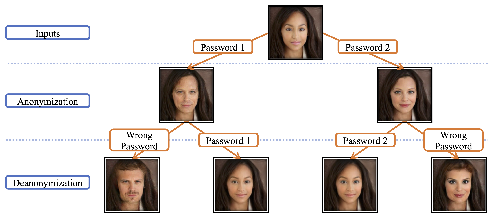

# Password-conditioned Face Identity Transformer

This is the PyTorch implementation of our paper [**Password-conditioned Anonymization and Deanonymization with Face Identity Transformers**](https://arxiv.org/abs/1911.11759) in ECCV 2020.

* [Paper (Arxiv)](https://arxiv.org/abs/1911.11759).
* [60-seconds presentation](https://youtu.be/9nn3lvr6IsU).
* [10-minutes presentation](https://youtu.be/hANVFxC9Szo).




## Demo
Here is a demo of our method applied on video in the wild:
[](https://www.youtube.com/watch?v=FrYmf-CL4yk&t=2s)


## Environment setup
Our code is developed and tested under
* Linux.
* Python 3.6.
* [PyTorch](https://pytorch.org/) 1.1 and torchvision 0.3.0. It should work with PyTorch versions up to 1.3 (may need minor modifications TODO) and we have never tried later versions.
* NVIDIA GPU and CUDA is required. (With a batch size of 12 per GPU, the training fits ~12GB GPUs including GeForce GTX 1080 Ti.)


### Get started
```bash
git clone https://github.com/laoreja/face-identity-transformer
pip install -r requirements.txt
mkdir pretrained_models
```
Please download and extract the pretrained [SphereFace model](https://github.com/clcarwin/sphereface_pytorch/blob/master/model/sphere20a_20171020.7z) from the [SphereFace PyTorch repo](https://github.com/clcarwin/sphereface_pytorch) and put it under the directory `pretrained_models`.

## Datasets

In our paper, we use the following three face datasets:

[//]: # (Possible link: The washed list can be downloaded from http://pan.baidu.com/s/1kUdRRJT with password 3zbb . For fast download find manuals how can you do it from baidu".)

* [CASIA-Webface](https://arxiv.org/abs/1411.7923) dataset.
* [LFW](http://vis-www.cs.umass.edu/lfw/) dataset: Download and extract from this [link](http://vis-www.cs.umass..edu/lfw/lfw.tgz).
* [FFHQ](https://github.com/NVlabs/ffhq-dataset) dataset: We use the validation set of thumbnail version, since it matches the image size we use (128x128).

We use [MTCNN](https://ieeexplore.ieee.org/abstract/document/7553523) to obtain the face landmarks and you can download them from this [Google Drive folder](https://drive.google.com/drive/folders/1VHthSoPHC6m9imQzODU4m5k1mYB_D0fk?usp=sharing).

We store and organize all face datasets in the same directory `data_root`, and use an argument `data_root` in our code to fetch the datasets. Please download the datasets and set the `data_root` argument either in the command line or in the YAML config.

The `data_root` directory is organized as:
```
data_root
+-- CASIA-WebFace
+-- casia_landmark.txt
+-- lfw
+-- lfw_landmark.txt
+-- ffhq-dataset
|   +-- validation_paths.txt
```


## Training
Adjust the `batch_size` in `config/main.yaml` and `CUDA_VISIBLE_DEVICES` according to the number of your available GPUs (`12 x num_gpus`). 

We only use the CASIA-Webface for training. Please set the `dataset` argument to `CASIA` (current default setting).
```bash
CUDA_VISIBLE_DEVICES=0,1,2,3 python3 main_train.py config/main.yaml
```

## Inference

### Qualitative results on test images
```bash
CUDA_VISIBLE_DEVICES=0,1,2,3 python3 save_visual.py CHECKPOINT_DIR_TO_RESUME/xxxx.yaml --ckpt_name checkpoint_xxxx.pth.tar --dataset DATASET [--inference_full] 
```

The code would copy the config yaml file to the checkpoint directory (`CHECKPOINT_DIR_TO_RESUME`) automatically during training, and it would use the same config during inference time.
The code would try to find the checkpoint with name `checkpoint_xxxx.pth.tar` from the directory `CHECKPOINT_DIR_TO_RESUME`. 

You could add option `--inference_full` to do inference on the full test set, otherwise it would save visuliazations for one randomly sampled batch of test images.

The code would automatically set the batch size (`batch_size_per_gpu_during_training x num_gpus_during_inference`) according to the number of GPUs you use during inference from the `CUDA_VISIBLE_DEVICES` environment variable.

### Multimodality: Same input face with different passwords
Given different passwords, our approach achieves multimodality on the same input face, like the following illustration.


  
```bash
CUDA_VISIBLE_DEVICES=0,1,2,3 python3 main_test_diff_passwds.py config/main.yaml --resume CHECKPOINT_PATH
```
`CHECKPOINT_PATH` is the path to the checkpoint (`.pth.tar`) file. Please make sure that the YAML config file in the arguments is the same config you used during training. (Since we use a 16-bit password, sometimes the identity difference is subtle.)

## Trained model
You can download our trained model from this [Google drive folder](https://drive.google.com/drive/folders/1s1L0W9fjCVUyRCScYmLMc5Oy7hsTe7Sh?usp=sharing). It also comes with the YAML config so that you could try `save_visual.py` with this folder.


## Citation

If you find our work useful in your research, please cite our [paper](https://arxiv.org/abs/1911.11759).

```
@inproceedings{gu2019password,
  title={Password-conditioned Anonymization and Deanonymization with Face Identity Transformers},
  author={Gu, Xiuye and Luo, Weixin and Ryoo, Michael S and Lee, Yong Jae},
  booktitle={European Conference on Computer Vision},
  year={2020}
}
``` 

## Acknowledgements
We adapt [clcarwin's SphereFace PyTorch implementation](https://github.com/clcarwin/sphereface_pytorch) and use their pretrained model. Some of our code are adapted from [CycleGAN](https://github.com/junyanz/pytorch-CycleGAN-and-pix2pix) and [pix2pixHD](https://github.com/NVIDIA/pix2pixHD) implementations.

We also thank [Jason Zhongzheng Ren](https://jason718.github.io/) for his support on this work, and our work is inspired from this awesome paper: [Learning to Anonymize Faces for
Privacy Preserving Action Detection](https://jason718.github.io/project/privacy/main.html), Zhongzheng (Jason) Ren, Yong Jae Lee, Michael S. Ryoo, in ECCV 2018.